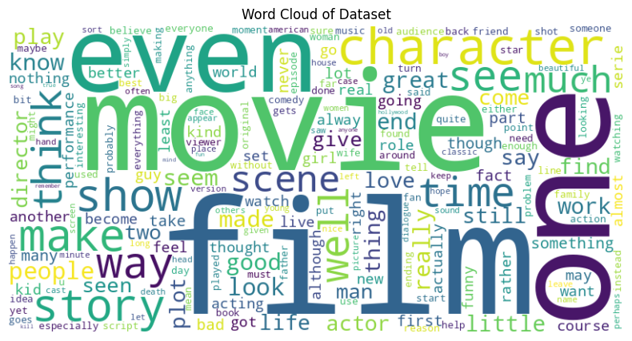
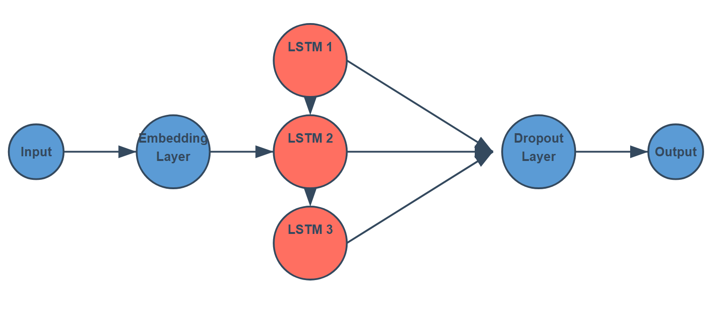

# Sentiment Analysis Using RNN

## Motivation
Sentiment analysis is a critical task in Natural Language Processing (NLP), enabling us to determine the sentiment behind a given text. This project utilizes a Recurrent Neural Network (RNN) with Long Short-Term Memory (LSTM) layers to classify movie reviews as either positive or negative. The goal is to build a robust, scalable model for binary sentiment analysis.

## Data Understanding
The dataset consists of movie reviews labeled as positive or negative. The key steps for processing include:
1. **Tokenization**: Converting reviews into word-level tokens.
2. **Integer Mapping**: Mapping words to unique integers based on vocabulary frequency.
3. **Padding**: Ensuring all sequences have a fixed length (e.g., 200) for uniform input to the model.

Sample data statistics:
- Training set: 2547 reviews
- Validation set: 318 reviews
- Test set: 319 reviews


## Modeling
The project uses an RNN architecture with the following components:
1. **Embedding Layer**: Converts words into dense vectors.
2. **LSTM Layers**: Captures sequential dependencies in text.
3. **Dropout**: Prevents overfitting.
4. **Fully Connected Layer**: Outputs a single sentiment score (0 for negative, 1 for positive).



## Learning
Training involved:
- Loss Function: Binary Cross-Entropy Loss
- Optimizer: Adam
- Hyperparameters:
  - Learning rate: 0.001
  - Hidden units: 256
  - Embedding dimension: 400
  - Number of layers: 2

The training ran for 4 epochs, with validation accuracy peaking at ~70%.


## Results
### Quantitative Analysis
|Test Loss| 0.464 |
|---------|-------|
|Test Accuracy| 80.5% |

### Qualitative Analysis
The model correctly identifies sentiments in most cases. Example predictions:
- Positive Review: "This movie had the best acting and the dialogue was so good." → **Positive**
- Negative Review: "The worst movie I have seen; acting was terrible and I want my money back." → **Negative**

## Inference
You can test your own reviews using the `predict` function in the notebook. Example:
```python
your_review = "The plot was engaging and the characters were well-developed."
predict(net, your_review, seq_length=200)
```

## Conclusion
This project highlights the power of RNNs for text-based sentiment analysis. Future work may involve exploring advanced architectures like Transformer models for better performance.

## Requirements
- Python 3.x
- PyTorch
- NumPy
- Pandas
- Matplotlib

## Running the Project
1. Clone the repository:
   ```bash
   git clone https://github.com/joseantoniormc/Sentimient_Analysis.git
   ```
2. Install dependencies:
   ```bash
   pip install -r requirements.txt
   ```
3. Open the notebook and run all cells:
   ```bash
   jupyter notebook Sentiment_Analysis_RNN.ipynb
   ```
